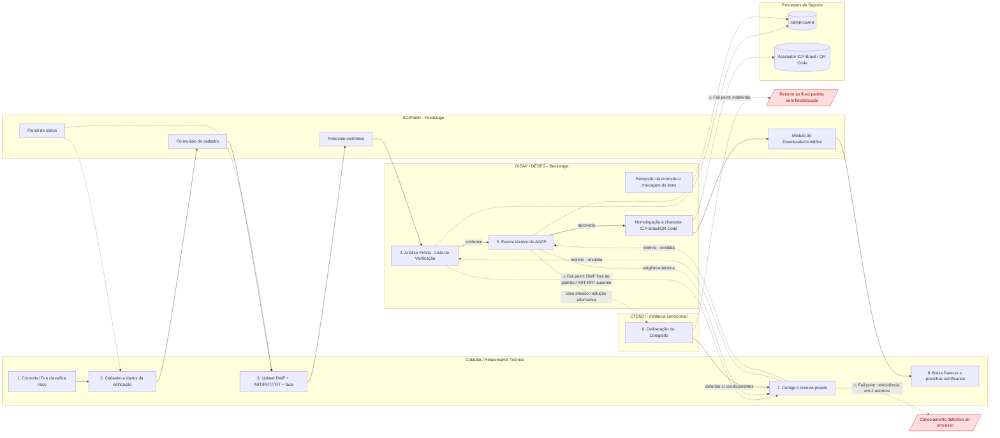

## Diagrama AS-IS — Análise de PSCIP (Obra Inicial) para Habite-se no DF

**Legenda:**
- Setas sólidas (`-->`): fluxo principal da jornada (1 → 2 → 3 → 4 → 5 → 8).
- Setas tracejadas (`-.->`): fluxos condicionais/iterativos (correção, encaminhamento ao CTDSCI) e interações com sistemas de suporte/painel de status.
- Nós vermelhos (`⚠`): fail points que interrompem ou revertem a jornada (devolução, indeferimento, cancelamento).
- *Subgraphs*: representam os atores/camadas — Cidadão (Ações do Cidadão), SCIPWeb (Frontstage), DIEAP/DESEG (Backstage), CTDSCI (instância condicional) e Processos de Suporte.
